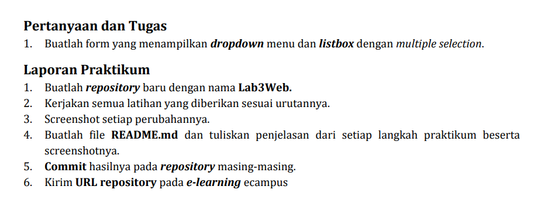
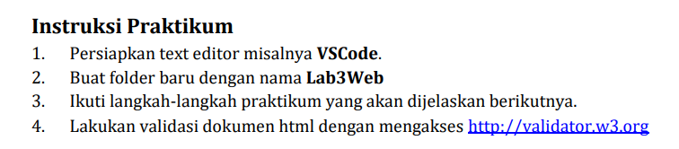
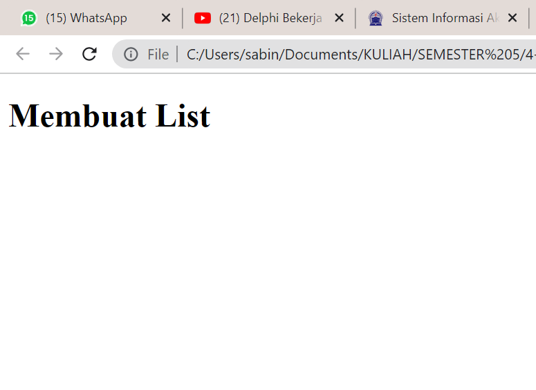

# Lab3Web_
Repository ini di buat untuk memenuhi tugas bahasa pemrograman pertemuan 4
<br>
=======================================================================
<br>
Nama		: Sandi Bintara
<br>
NIM		: 312010039
<br>
Kelas		: TI20B1
<br>
=======================================================================

# Soal
<br>


<br>

=======================================================================
<br>

# Intruksi Tugas
<br>


<br>
=======================================================================
<br>

> Membuat dokumen HTML dengan nama file lab3_list.html seperti berikut.
<br>

```
<!DOCTYPE html>
<html lang="en">
<head>
 <meta charset="UTF-8">
 <meta name="viewport" content="width=device-width, initial-scale=1.0">
 <title>HTML Lanjutan</title>
</head>
<body>
 <header>
 <h1>Membuat List</h1>
 </header>
</body>
</html>
```
<br>

> Outputnya
<br>


<br>


